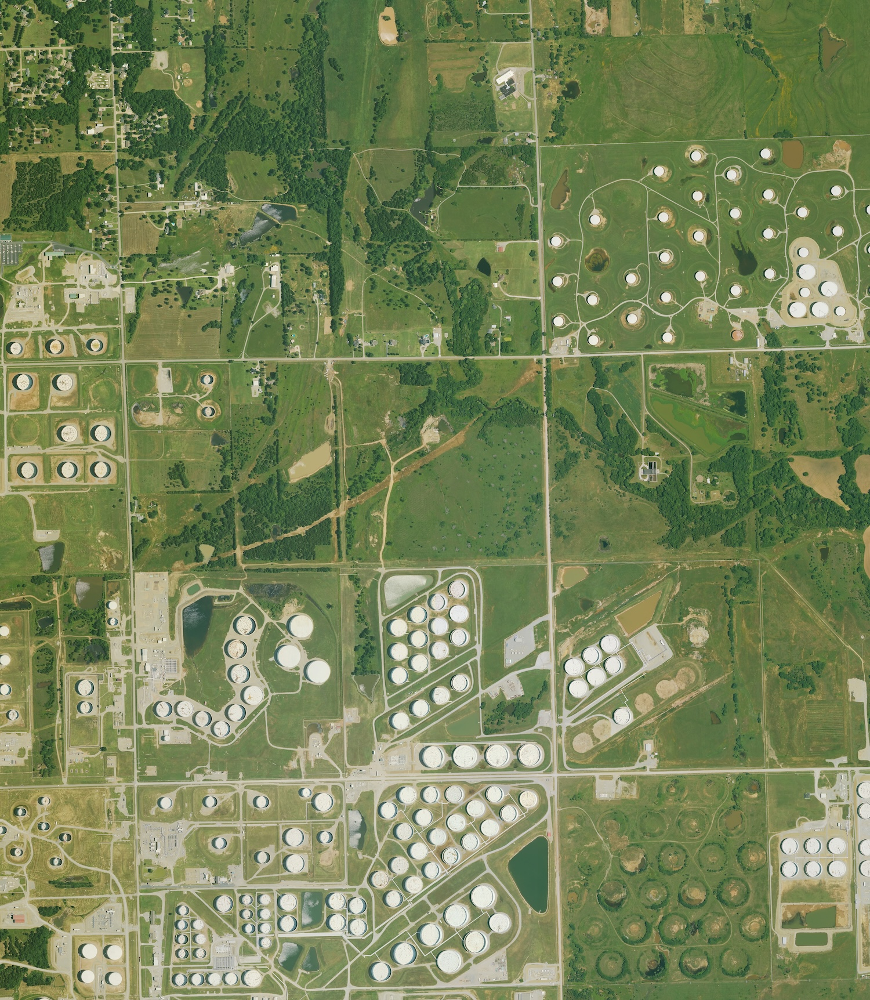
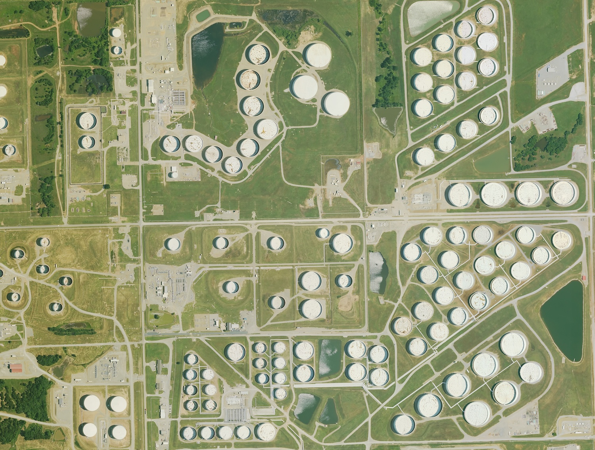
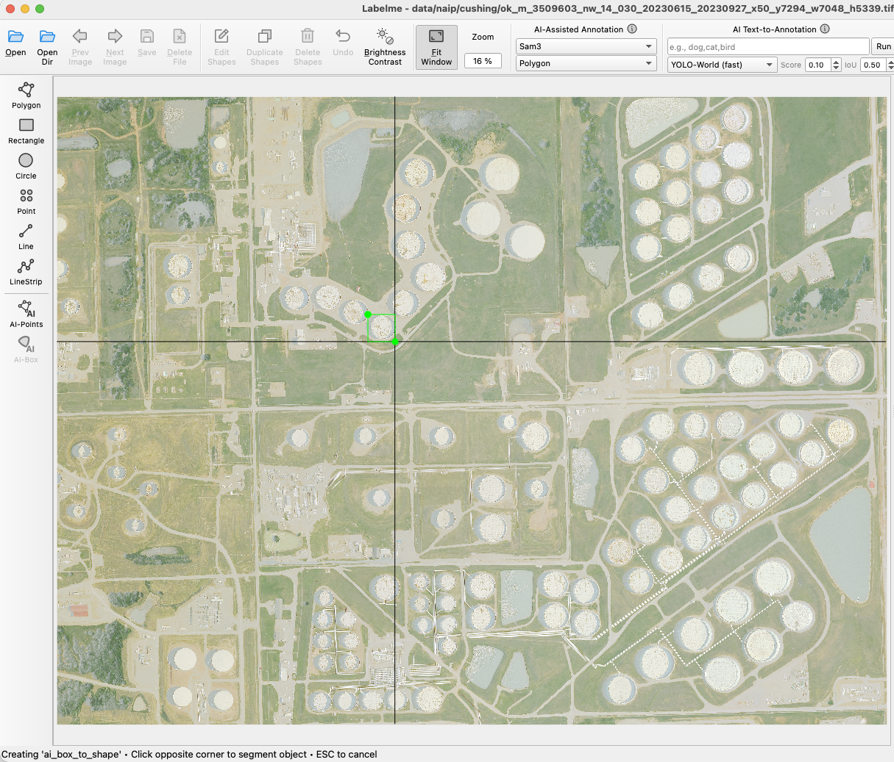
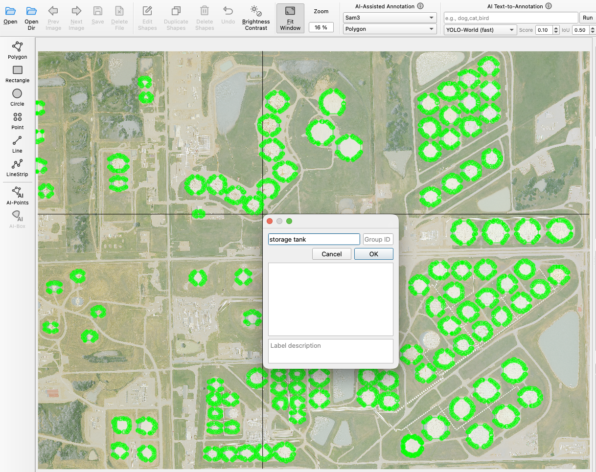
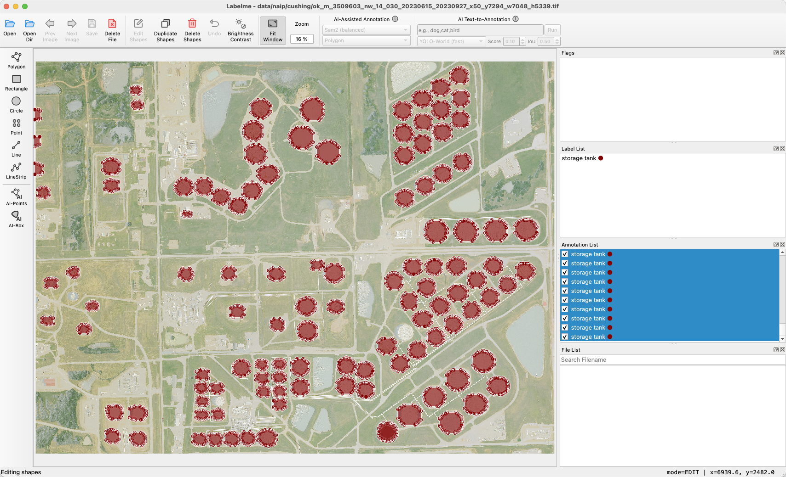
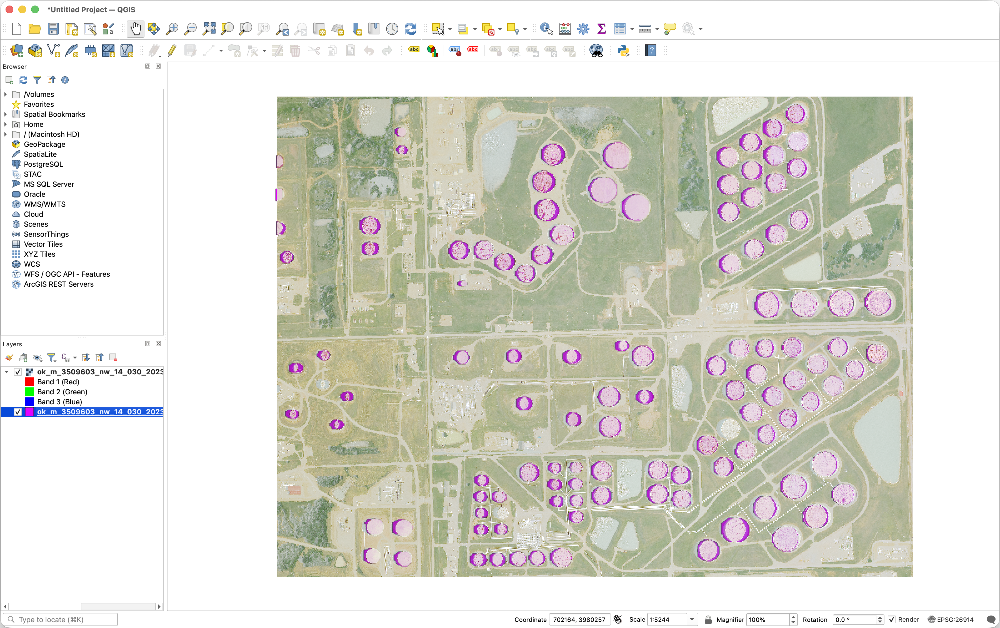

# LabelMe Satellite Image Demo

Annotate satellite imagery with [LabelMe](https://github.com/wkentaro/labelme) and convert the annotations to [GeoJSON](https://geojson.org) for use in GIS tools like [QGIS](https://qgis.org).

## Setup

```bash
uv sync
```

## Workflow

### 1. Download NAIP imagery

```bash
uv run python download_naip.py cushing
```

This downloads a NAIP tile and saves a cropped GeoTIFF + PNG preview to `data/naip/<location>/`.

Available locations: `cushing`, `houston`, `alta-wind`.



### 2. Crop a region of interest

```bash
uv run python crop_geotiff.py data/naip/cushing/<tile>.tif
```

A window opens to draw a rectangle over the area you want. The output GeoTIFF keeps its geo-referencing.



### 3. Annotate with LabelMe

```bash
uv run labelme data/naip/cushing/
```

Open the cropped GeoTIFF in LabelMe. You can use AI-assisted annotation to speed things up — draw a bounding box and it segments the object automatically.

 



### 4. Convert to GeoJSON

```bash
uv run python labelme_to_geojson.py data/naip/cushing/<tile>.json
```

Converts pixel coordinates from the LabelMe JSON into geo-referenced polygons using the GeoTIFF's affine transform.

### 5. Open in QGIS

Load both the GeoTIFF and the `.geojson` in QGIS to check that annotations line up with the imagery.


