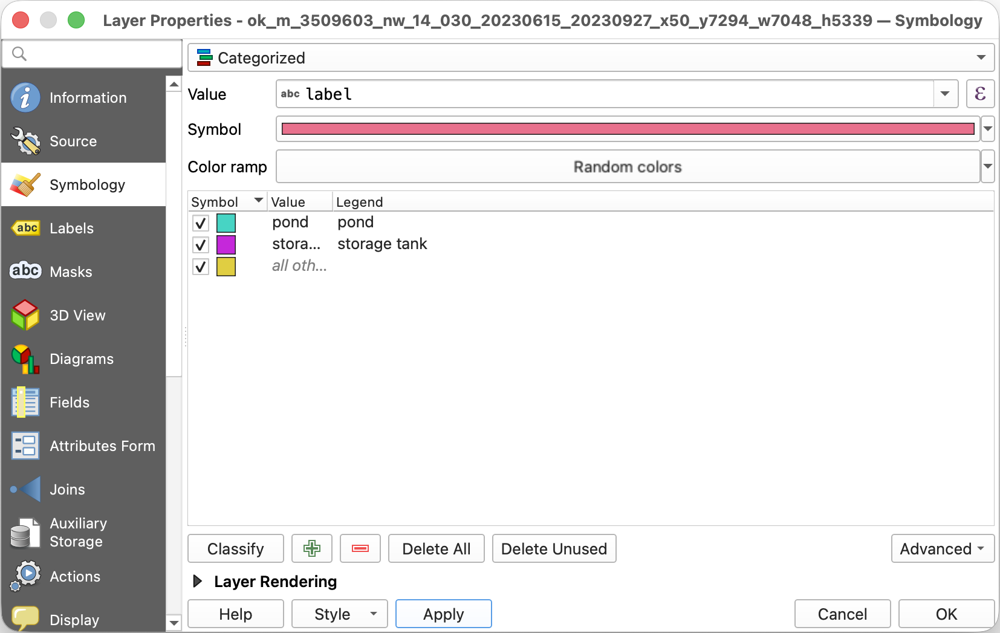

# labelme-satellite-image-demo

[](https://github.com/wkentaro/labelme-satellite-image-demo/actions/workflows/test.yml)

Annotate satellite imagery in LabelMe. Export to any GIS tool.

<table>
<tr>
<td width="33%"></td>
<td width="33%"></td>
<td width="33%"></td>
</tr>
<tr>
<td align="center"><sub>NAIP tile</sub></td>
<td align="center"><sub>annotated in LabelMe</sub></td>
<td align="center"><sub>GeoJSON in QGIS</sub></td>
</tr>
</table>

Downloads a [NAIP](https://planetarycomputer.microsoft.com/dataset/naip) aerial image from the [Microsoft Planetary Computer](https://planetarycomputer.microsoft.com/), annotates it in [LabelMe](https://github.com/wkentaro/labelme) with AI-assisted segmentation, and exports geo-referenced [GeoJSON](https://geojson.org) for [QGIS](https://qgis.org) or any GIS stack.

## Prerequisites

- [uv](https://docs.astral.sh/uv/getting-started/installation/) - Manage Python and dependencies.
- [QGIS](https://qgis.org) - Open GeoJSON and verify the output visually.

## Steps

### 1. Install dependencies

```bash
uv sync
```

### 2. Download NAIP imagery

```bash
uv run python download_naip.py cushing
```

Downloads a NAIP tile cropped to the target area and saves a GeoTIFF to `data/naip/<location>/`.

Available locations: `cushing`, `houston`, `alta-wind`.

> [!NOTE]
> NAIP only covers the US. For imagery elsewhere, swap in a different [Planetary Computer collection](https://planetarycomputer.microsoft.com/catalog) (Sentinel-2, Landsat, etc.) inside `download_naip.py`.


### 3. Crop a region of interest

```bash
uv run python crop_geotiff.py data/naip/cushing/<tile>.tif
```

A window opens. Draw a rectangle around the area you want. The output GeoTIFF keeps the source CRS and geo-transform.


### 4. Annotate with LabelMe

```bash
uv run labelme data/naip/cushing/
```

Open the cropped GeoTIFF in LabelMe.

> [!TIP]
> Use the AI Polygon tool: draw a bounding box and LabelMe traces the shape inside.


### 5. Convert to GeoJSON

```bash
uv run python labelme_to_geojson.py data/naip/cushing/<tile>.json
```

Converts LabelMe's pixel coordinates into geo-referenced polygons using the GeoTIFF's affine transform. Supports `polygon`, `rectangle`, and `circle` annotations.

### 6. Open in QGIS

Load both the GeoTIFF and the `.geojson` in QGIS to check that annotations line up with the imagery.


To color by class in QGIS:

1. Right-click the layer → **Properties** → **Symbology**
1. Change the dropdown from **Single Symbol** to **Categorized**
1. Set **Value** to `label`
1. Click **Classify** → **OK**




